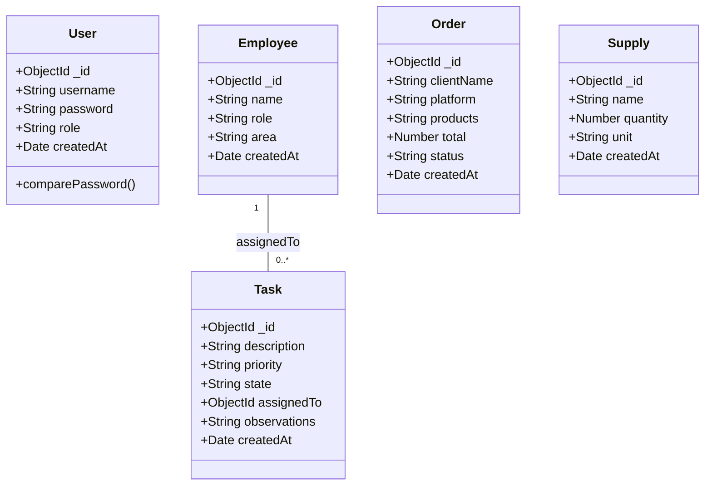
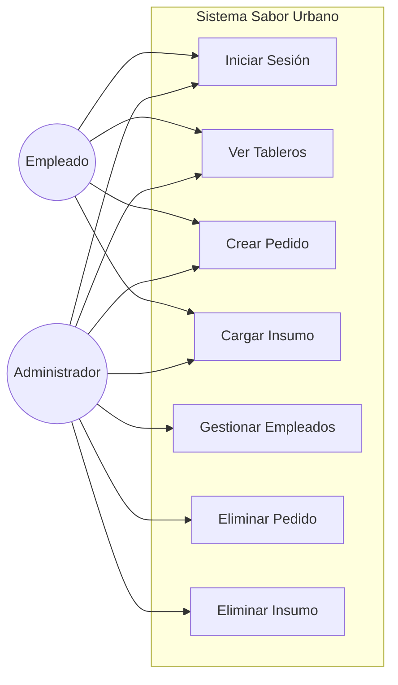
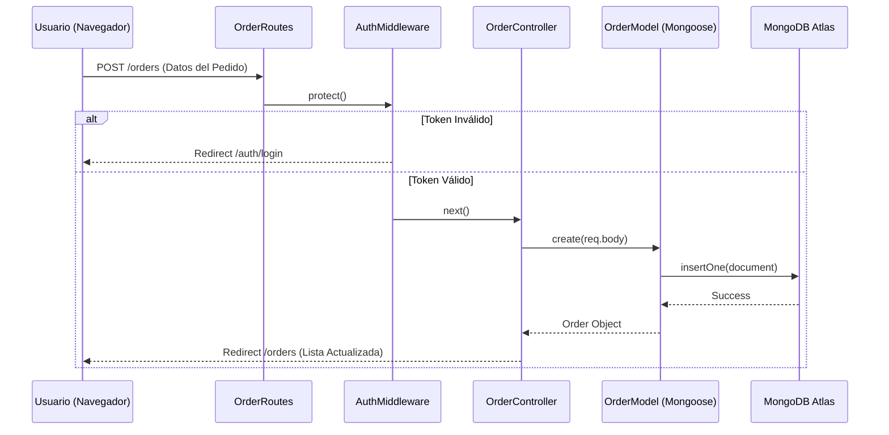

# Documentación del Sistema - Sabor Urbano

## 1. Explicación del Funcionamiento

El sistema "Sabor Urbano" es una aplicación web Backend diseñada para gestionar la operatividad de un restaurante con servicio de delivery. Está construida sobre una arquitectura **MVC (Modelo-Vista-Controlador)** utilizando **Node.js** y **Express**, con persistencia de datos en **MongoDB Atlas**.

### Módulos Principales:

*   **Autenticación (Auth):**
    *   Gestiona el acceso seguro al sistema.
    *   Utiliza **JWT (JSON Web Tokens)** almacenados en cookies HTTP-Only para mantener la sesión.
    *   Implementa **Hashing de contraseñas** con `bcryptjs` para seguridad.
    *   Define dos roles: `admin` (acceso total) y `employee` (acceso operativo).

*   **Empleados (Employees):**
    *   Permite registrar y administrar el personal del restaurante.
    *   Almacena datos como nombre, rol (cocinero, mozo, etc.) y área de trabajo.
    *   *Restricción:* Solo los administradores pueden crear, editar o eliminar empleados.

*   **Tareas (Tasks):**
    *   Sistema de asignación de trabajo.
    *   Permite crear tareas, asignar prioridades (Alta, Media, Baja) y estados (Pendiente, En Proceso, Finalizada).
    *   Las tareas se asignan a empleados específicos registrados en el sistema.

*   **Pedidos (Orders):**
    *   Módulo central para la operación del restaurante.
    *   Registra pedidos provenientes de múltiples fuentes (Local, Rappi, PedidosYa).
    *   Calcula totales y sigue el estado del pedido.
    *   *Seguridad:* Los empleados pueden cargar pedidos, pero solo los administradores pueden eliminarlos.

*   **Inventario (Inventory):**
    *   Control de stock de insumos críticos.
    *   Permite agregar y visualizar ingredientes con sus cantidades y unidades.
    *   *Seguridad:* Al igual que los pedidos, solo los administradores pueden dar de baja insumos.

---

## 2. Diagramas del Sistema

### A. Diagrama de Clases (Modelo de Datos)

Representa las entidades almacenadas en MongoDB y sus relaciones.

### B. Diagrama de Casos de Uso

Muestra qué acciones puede realizar cada tipo de usuario (Admin vs Empleado).

### C. Diagrama de Secuencia (Creación de un Pedido)

Muestra el flujo de datos desde que el usuario envía el formulario hasta que se guarda en la base de datos.

